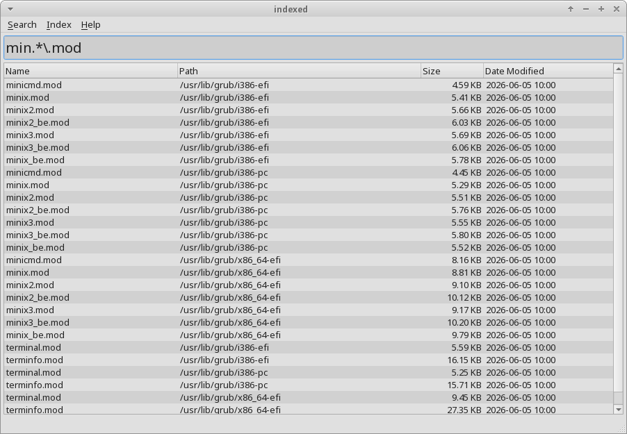
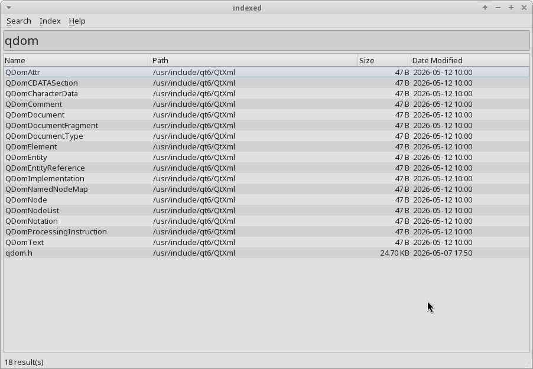
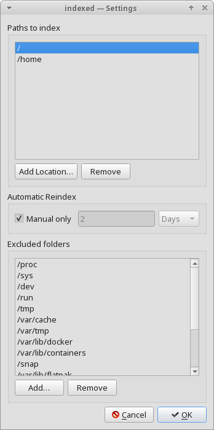

# indexed

Blazing fast file search for Linux. `indexed` builds a full index of your local
filesystems and returns results as you type, with no perceptible delay even across
millions of files. It is a feature-for-feature Linux port of
[winindex](https://github.com/rajeshsub/winindex).


[](https://github.com/rajeshsub/indexed/actions/workflows/dependency-scan.yml)



---

## Features

- **Instant search** -- results appear as you type, debounced at 150 ms
- **Parallel directory-walk scanning** -- a `getdents64` + `statx` walker, parallelized
  across a thread pool (no raw on-disk filesystem structure to shortcut through on Linux
  -- see `docs/adr/0002-directory-walk-scanning-strategy.md`)
- **Live monitoring** -- fanotify whole-mount monitoring via a privileged helper, with an
  inotify fallback when unprivileged
- **Regex support** -- powered by [RE2](https://github.com/google/re2); toggle with Alt+1
- **SIMD-accelerated substring search** -- AVX2/SSE4.2 on x86-64 with runtime dispatch;
  scalar on aarch64 in v0.1.0
- **Word-level matching** -- queries with spaces, underscores, or hyphens match filenames
  by token set, so `just rosy guitar` finds `LedZep_Just-Rosy_June-Bug_guitar.flac`
- **Search modes** -- case-sensitive, whole-word, match full path, ignore diacritics
- **Portable mode** -- place an `indexed.conf` next to the executable and all data stays
  in that directory
- **Persistent index** -- serialized to disk (CRC-32 validated) and loaded on startup;
  only rebuilt when stale, corrupt, or missing
- **Context menu** -- open file, open containing folder, copy full path, copy filename,
  cut (move), delete (to Trash), drag-and-drop out to file managers
- **Smart exclusions** -- pseudo-filesystems, container storage, and Flatpak data are
  excluded by default; fully user-configurable

`indexed` is **GUI-only** -- there is no CLI query mode (a deliberate scope decision; see
the Decisions Log in `indexed-plan.md` §18).

---

## How it works

```
   WalkScanner (getdents64)
           |
           | scan
           v
        Indexer  ----------->  IndexStore (memory + .idx)
                    index               |
   FanotifyMonitor  -------> (apply     | entries
   InotifyWatcher    change)  changes)  |
                                        v
                               SearchEngine (RE2 / SIMD / token)
                                        |
                                        v
                                 Qt MainWindow
```

The indexer/monitor runs in a separate privileged process (`indexed-helper`, elevated via
`pkexec` for the lifetime of the GUI session -- see
`docs/adr/0008-privileged-helper-and-elevation.md`); the GUI itself never runs as root and
only loads/searches the on-disk index in-process.

---

## Releases

Prebuilt `indexed-x86_64.AppImage` builds are attached to
[GitHub Releases](https://github.com/rajeshsub/indexed/releases) on tagged versions.

```bash
chmod +x indexed-x86_64.AppImage
./indexed-x86_64.AppImage
```

The AppImage bundles Qt; no system Qt install is required to run it. The first action
that needs full-filesystem monitoring (fanotify) prompts once via `pkexec`/polkit for
the lifetime of the GUI session -- see "Privileged monitoring" below.

Each release also publishes a `SHA256SUMS` file. Verify the download before running it:

```bash
sha256sum -c SHA256SUMS
```

Git tags are not currently GPG-signed (docs/adr/0010-release-integrity-verification.md);
the checksum above confirms the download matches what CI built and published for that
tag, not that the tag itself was signed by the maintainer.

---

## Settings

Available from the menu bar (First-Run dialog shows the same fields on first launch):

- **Paths to index** -- add/remove the mounts or directories indexed
- **Automatic Reindex** -- "Manual only", or an interval in hours/days
- **Excluded folders** -- pseudo-filesystems, container storage, and Flatpak data are
  excluded by default; add/remove your own
- **Portable mode** -- place an `indexed.conf` next to the executable to keep all data
  (index, settings, logs) in that directory instead of `$XDG_*`

## Shortcuts

| Shortcut | Action |
|----------|--------|
| `Alt+1` | Toggle Regular Expression |
| `Alt+2` | Toggle Case Sensitive |
| `Alt+3` | Toggle Whole Word |
| `Alt+4` | Toggle Match Path |
| `Alt+5` | Toggle Ignore Diacritics |
| `Up` / `Down` (in search box) | Move selection in the result list |
| `Enter` | Open selected file |
| `Ctrl+Enter` | Open containing folder |
| `Ctrl+C` | Copy file(s) (paste into a file manager copies the file; plain-text path elsewhere) |
| `Ctrl+X` | Cut file(s) (paste into a file manager moves the file) |
| `Delete` | Move to Trash |
| `Shift+Delete` | Delete permanently (asks first) |

Drag a result onto a file manager to copy it there. `Ctrl+X` and drag-copy
follow the freedesktop `text/uri-list` and `x-special/gnome-copied-files`
conventions understood by Nautilus, Nemo, Caja, and Thunar; Dolphin pastes a
copy in every case.

## Privileged monitoring

Full-system live monitoring uses `fanotify`, which requires root; `indexed-helper`
requests that once per GUI session via `pkexec` (see
`docs/adr/0008-privileged-helper-and-elevation.md`). Without elevation, indexed still
works fully, falling back to unprivileged `inotify` watches per indexed root.

The polkit policy (`packaging/polkit/org.indexed.helper.policy`) must be registered on
the system for the `pkexec` prompt to appear -- `cmake --install` places it under
`share/polkit-1/actions` on distro-style installs. **The AppImage does not do this
automatically** (AppImages are installer-free by design); until a proper first-run
installer exists, copy it once manually:

```bash
./indexed-x86_64.AppImage --appimage-extract usr/share/polkit-1/actions/org.indexed.helper.policy
sudo cp squashfs-root/usr/share/polkit-1/actions/org.indexed.helper.policy /usr/share/polkit-1/actions/
rm -rf squashfs-root
```

---

## Screenshots

| Substring search | Regex search | Settings |
|---|---|---|
|  |  |  |

---

## Building

### Requirements

| Tool | Minimum version |
|------|----------------|
| Linux kernel | 5.4 to run; 5.9 for full fanotify monitoring |
| CMake | 3.28 |
| GCC or Clang | C++20 support |
| Qt 6 | Widgets + DBus (system package, e.g. `qt6-qtbase-devel` on Fedora) |
| Git | any recent |

Third-party dependencies (**re2**, **abseil**, **utf8proc**, **GoogleTest**) are fetched
automatically by CMake's `FetchContent` -- no manual installation needed.

**Platform testing:** this is a solo side project, and Fedora (XFCE) is the only distro
it's actually been run on. There's nothing Fedora-specific in the code, and it's reasonably
expected to work on other mainstream distros (Ubuntu, Arch, openSUSE, etc.), but that's
untested, not verified. If you hit an issue on another distro,
[open an issue](https://github.com/rajeshsub/indexed/issues) -- happy to fix it.

### Quick build

```bash
./build.sh debug
./build.sh release
```

Or with CMake presets directly:

```bash
cmake --preset linux-gcc-release
cmake --build --preset linux-gcc-release
```

### Running tests

```bash
./build.sh test
```

### Running benchmarks

Off by default (`docs/adr/0011-benchmark-tooling.md`); build with
`-DBUILD_BENCHMARKS=ON` to enable:

```bash
cmake --preset linux-gcc-release -DBUILD_BENCHMARKS=ON
cmake --build --preset linux-gcc-release --target bench_SearchEngine bench_WalkScanner
./build/release/benchmarks/bench_SearchEngine
./build/release/benchmarks/bench_WalkScanner
```

CI tracks both, plus test-suite duration, as trend charts on every push to `main`.

### Building the AppImage

```bash
packaging/appimage/build-appimage.sh
```

Configures/builds a release tree if needed, then uses **linuxdeploy** +
**linuxdeploy-plugin-qt** (fetched on first run, cached under
`packaging/appimage/tools/`) to produce `packaging/appimage/indexed-x86_64.AppImage`.

---

## Project structure

```
indexed/
  src/
    core/       indexer/, search/, settings/, storage/, platform/ (Qt-free, C++20)
    ui/         Qt MainWindow, search bar, result view
    helper/     privileged indexer + fanotify monitor entry point
  tests/        GoogleTest/GoogleMock unit tests
  benchmarks/   Google Benchmark perf tests (opt-in, -DBUILD_BENCHMARKS=ON)
  docs/adr/     Architecture Decision Records
  docs/architecture.md   Current system shape (components, data flow, runtime flows)
  packaging/
    indexed.desktop, icons/, metainfo/  desktop integration + AppStream metadata
    polkit/       polkit policy for indexed-helper elevation
    appimage/     build-appimage.sh, AppImage output (gitignored)
  .github/workflows/  CI: lint, build+test, ASAN, coverage, benchmarks, dependency
                      scan, release (AppImage on tag)
  CMakeLists.txt
  CMakePresets.json
  build.sh      Convenience wrapper: build.sh [debug|release|asan|test|all|clean]
  indexed-plan.md   Full implementation plan and milestones
```

---

## Development setup

```bash
sudo apt-get install -y cppcheck=2.13.0-2ubuntu3  # pin matches .github/workflows/ci.yml
pip install pre-commit
pre-commit install
pre-commit install --hook-type pre-push
```

`pre-commit install` wires commit-time checks (clang-format, cppcheck).
`pre-commit install --hook-type pre-push` wires the pre-push gate that builds and runs
the full test suite before a push. `cppcheck` itself is a system dependency the
pre-commit hook shells out to (unlike clang-format, which pre-commit installs and pins
itself in `.pre-commit-config.yaml`) -- install the exact version above so local runs
match CI (rule 4 in the engineering-standards this repo follows).

To run all checks on the full codebase (one-time cleanup):

```bash
pre-commit run --all-files
```

---

## License

MIT
